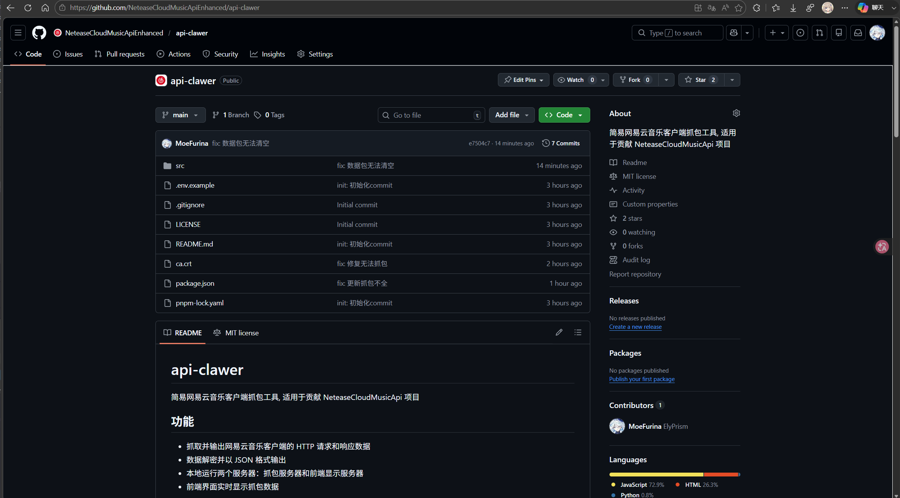
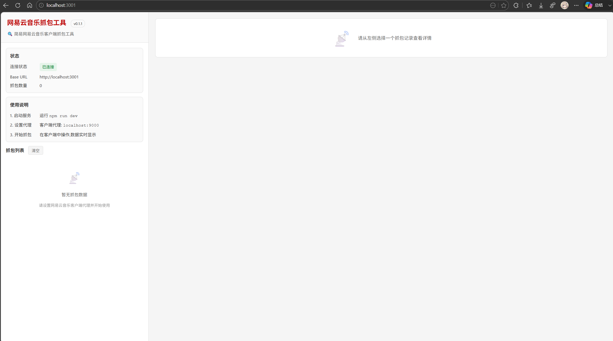
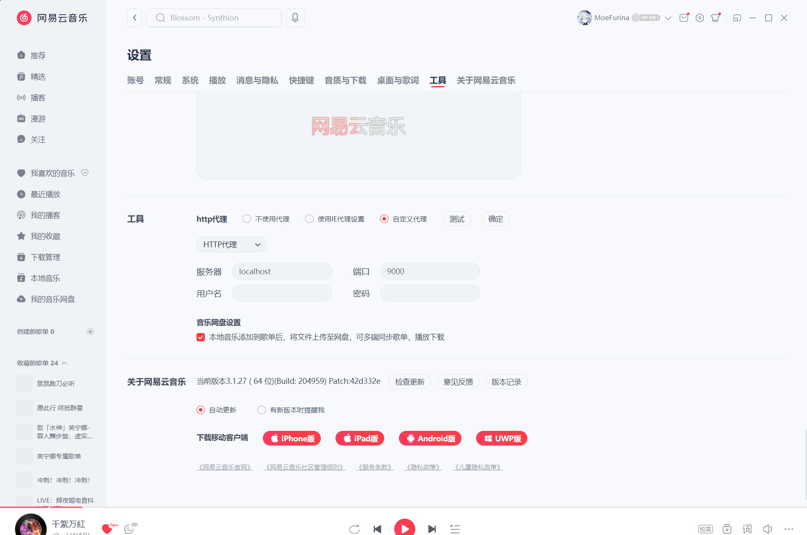
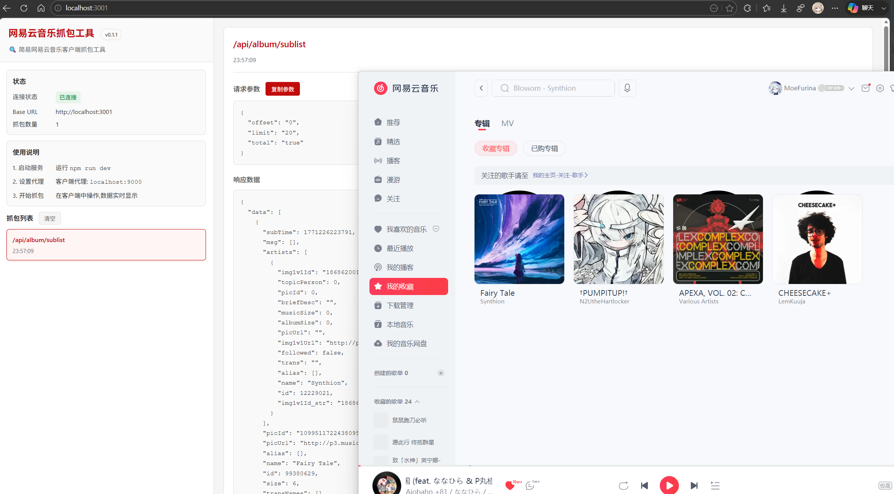

这篇文章将会详细描述了通过建议的抓包工具进行抓取网易云音乐接口的数据包, 并讲解了如何对网易云音乐 api 开源项目进行贡献.

## 视频教程

<iframe src="//player.bilibili.com/player.html?isOutside=true&aid=116228643363668&bvid=BV1xKw8zmEZy&cid=25980246711&p=1" scrolling="no" border="0" frameborder="no" framespacing="0" allowfullscreen="true"></iframe>

[点击观看视频教程](https://www.bilibili.com/video/BV1xKw8zmEZy)

## 抓包工具

针对网易云音乐接口的抓包, 组织[NeteaseCloudMusicApiEnhanced](https://github.com/neteasecloudmusicapienhanced)提供了一个专门的抓包工具[api-clawer](https://github.com/neteasecloudmusicapienhanced/api-clawer) , 这个工具可以帮助我们轻松地抓取网易云音乐接口的数据包, 并且提供了一个友好的界面来查看和分析这些数据包. 下文将会详细介绍如何使用这个工具来抓取网易云音乐接口的数据包.



### 下载工具

首先, 我们需要克隆这个仓库到本地. 可以使用以下命令来克隆仓库:

```bash
git clone https://github.com/neteasecloudmusicapienhanced/api-clawer.git
```

在克隆完成后, 进入到项目目录中并安装项目依赖:

```bash
cd api-clawer

pnpm install
```
安装完成后, 我们需要设定定环境变量来启用工具. 可以在项目根目录下创建一个`.env`文件, 并添加以下内容:

```env
# 前端服务器端口, 默认为3000, 这个端口是用来访问抓包工具的界面的, 可以根据需要进行修改
PORT=3000

# 抓包代理服务器端口, 默认为9000, 这个端口是用来抓取网易云音乐接口的数据包的, 可以根据需要进行修改
HOOK_PORT=9000
```

### 启动工具

在上述步骤完成后, 我们可以使用以下命令来启动工具:

```bash
pnpm start
```

启动完成后, 我们可以在浏览器中访问`http://localhost:3000`来打开抓包工具的界面. 在界面中, 我们可以看到一个输入框, 这个输入框是用来输入网易云音乐接口的 URL 的. 当我们在网易云音乐中进行操作时, 相关的接口请求会被抓取并显示在界面上.



## 设定代理

为了能够抓取网易云音乐接口的数据包, 我们需要设定代理来将请求转发到抓包工具的代理服务器上. 我们打开网易云音乐客户端, 进入到设置界面, 找到网络设置, 在代理设置中选择手动设置代理, 并将代理服务器的地址设定为`http://localhost:9000` (如果你在`.env`文件中修改了`HOOK_PORT`, 请使用你设定的端口号).



设定完成后, 记得点击测试代理检测代理是否设置成功. 如果设置成功, 那么当我们在网易云音乐中进行操作时, 相关的接口请求就会被抓取并显示在抓包工具的界面上.

## 贡献接口数据包
当我们在抓包工具的界面上看到相关的接口请求时, 我们可以点击每个请求来查看详细的信息. 在请求详情页面中, 我们可以看到请求的 URL、请求方法、请求头、请求体、响应状态码、响应头和响应体等信息. 如果我们发现了一个新的接口或者一个接口的参数发生了变化, 我们可以将这个接口的数据包贡献到开源网易云音乐 api 项目中.

假设我们要添加一个`我的收藏专辑`接口, 首先启动抓包工具, 在网易云音乐客户端设置好代理后, 我们进入到`我的收藏专辑`页面, 相关的接口请求就会被抓取并显示在抓包工具的界面上. 我们点击这个请求来查看详细的信息, 然后我们可以将这个接口的数据包贡献到开源网易云音乐 api 项目中.



我们通过抓包工具知道了这个接口的 URL 是`/api/album/sublist`, 请求头和请求体中包含了相关的参数, 如:

```json
{
  "offset": "0", // 这里的offset参数是用来分页的, 代表着从第几条数据开始获取, 默认为0
  "limit": "20", // 这里的limit参数是用来分页的, 代表着每页获取多少条数据, 默认为20
  "total": "true"
}
```
这些参数需要自己去分析和理解, 以便在贡献接口数据包时能够正确地使用这些参数来获取数据.

我们可以将这个接口的数据包贡献到开源网易云音乐 api 项目中, 以便其他开发者能够使用这个接口来获取用户的收藏列表. 贡献的步骤如下:

1. fork 开源网易云音乐 api 项目到自己的 GitHub 账户中, [前往 fork](https://github.com/NeteaseCloudMusicApiEnhanced/api-enhanced/fork).
2. 克隆 fork 后的仓库到本地, 进行开发(熟练使用`Git`是每个开发者的基本技能, 这里不再赘述).
3. 在本地的仓库中, 创建一个新的分支来进行开发, 例如`add-user-playlist-api`.
4. 在新的分支中, 在`modules/`文件夹内创建一个新的文件来定义这个接口, 例如`user_album.js`, 这代表着接口地址是`/user/album`.
5. 在这个文件中填好以下模板

```javascript
// 这里填写接口用处, 例如: 获取用户的收藏列表

const createOption = require('../util/option.js')
module.exports = (query, request) => {
  const data = {}
  return request(`/example`, data, createOption(query))
}
```

示例:

```javascript
// 获取用户收藏的专辑

const createOption = require('../util/option.js')
module.exports = (query, request) => {
  const data = {
  "offset": query.offset || "0", // 这里的"query.***"参数是需要传入的参数
  "limit": query.limit || "20", // 同上
  "total": "true"
}
  return request(`/api/album/sublist`, data, createOption(query))
}
```

6. 在本地测试这个接口是否能够正确地获取数据, 以确保接口的正确性.
7. 编写接口的文档, 以便其他开发者能够理解这个接口的用法和参数(文件处于`./public/docs/home.md`), 将内容追加到文档中(不要调整顺序)

比如:

```markdown
### 用户的收藏歌单列表

说明 : 调用此接口, 传入用户id, 获取用户的收藏歌单列表

**必选参数 :**

`uid`: 用户 id

**可选参数 :**

`limit` : 返回数量 , 默认为 100

`offset` : 偏移数量，用于分页 ,如 :( 页数 -1)\*30, 其中 30 为 limit 的值 , 默认为 0

**接口地址 :** `/user/playlist/collect`

**调用例子 :** `/user/playlist/collect?uid=32953014`
```

8. 提交代码并推送到远程仓库, 然后在 GitHub 上创建一个 Pull Request 来请求合并你的分支到主分支中. 我们会对你的 Pull Request 进行审核, 如果审核通过, 那么你的代码就会被合并到主分支中, 其他开发者就可以使用你贡献的接口了.

## 注意事项

在贡献接口数据包时, 请注意以下事项:

1. 在打开 Pull Request 之前, 请先使用`pnpm lint`命令来检查你的代码是否符合项目的代码规范, 以避免不必要的代码审查问题.
2. 在编写接口文档时, 请确保文档的内容清晰、准确, 以便其他开发者能够理解这个接口的用法和参数.
3. 在提交代码之前, 请确保你的代码已经过测试, 以确保接口的正确性